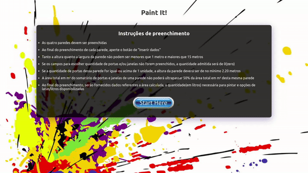

  

<h1 align="center">Paint It!</h1>

An application that works as a calculator to give informations about paint a room with four walls. Designed for Desktop mode.

## Demo

Try this project: https://paint-it.vercel.app/ 

Desktop demo:

    

 

## Used Technologies

* REACT.JS
* CSS

## Features

* Insert the dimensions of the wall(height and width)
* Insert with the wall has a door or a window
* Receive the total area and liters of paint needed
* Choose the availables cans of paint by liters
* Receive the information about how much cans by liters are needed

## To Run Locally

Clone the project

`git clone https://github.com/andrearnoni/paint-it.git`

Go to the project directory

`cd paint-it`

Install dependencies

`npm install`

Start the server

`npm start`

## Author

This project was coded and designed by [@andrearnoni](https://github.com/andrearnoni).

### Go to my [Portfolio!](https://andrearnoni.vercel.app/) 
### Connect with me at [LinkedIn!](https://www.linkedin.com/in/andrearnoni/) 